# Zestro 🛒⚡


**Zestro** is a high-performance, full-stack grocery delivery application built specifically to emulate the core functionalities of industry leaders like Blinkit and Swiggy Instamart. 

Developed exclusively with **Next.js** and **TypeScript**, Zestro delivers a seamless, end-to-end quick-commerce experience across three distinct user roles: Customers, Admins, and Delivery Personnel. It features real-time order tracking with live maps, secure online payments, AI-powered chat assistance, and dynamic analytics.

[](https://zestro-zeta.vercel.app/)
[](#)

## 🌟 Key Features

### 🛒 Customer Experience
* **Seamless Shopping**: Browse categories, view items via dynamic sliders, and manage a real-time shopping cart.
* **Secure Checkout**: Integrated with **Stripe** for safe and reliable online transactions.
* **Live Order Tracking**: Powered by **Leaflet**, allowing users to see their delivery progress on a live map.
* **Smart Chat Integration**: Real-time communication with the delivery person, featuring **Google Gemini AI** for smart response suggestions.

### 👑 Admin Capabilities
* **Centralized Dashboard**: View overarching metrics and graphical analytics built with **Recharts**.
* **Inventory Management**: Create, update, and delete grocery items. Media is handled efficiently via **Cloudinary**.
* **Order Oversight**: Monitor all incoming orders, manage statuses, and oversee the assignment of delivery personnel.

### 🛵 Delivery Partner Portal
* **Active Delivery Management**: View assigned tasks, track delivery routes, and update order statuses.
* **Real-time Notifications**: Instantly receive alerts for newly assigned deliveries.
* **Delivery Analytics**: Personal dashboard to track completed deliveries and performance metrics.

### ⚡ Technical Highlights
* **Real-Time Engine**: Built with a custom **Socket.io** server for instant chats and status updates.
* **Advanced Authentication**: Role-based access control with secure login/registration, plus OTP email verification powered by **Nodemailer**.
* **Fluid Animations**: Eye-pleasing, smooth UI transitions powered by **Framer Motion**.
* **Global State**: Efficient state management utilizing **Redux Toolkit**.

---

## 🛠️ Tech Stack

| Area | Technologies |
| :--- | :--- |
| **Frontend** |      |
| **Backend & DB** |     |
| **Tools & APIs** |     |

---

## 📸 Screenshots

A comprehensive look at the Zestro application workflow.

> **Note**: Images are referenced from the project's `screenshots` folder.

### **Authentication & Onboarding**

| Role Selection | Register | Login | OTP Verification |
| :---: | :---: | :---: | :---: |
| 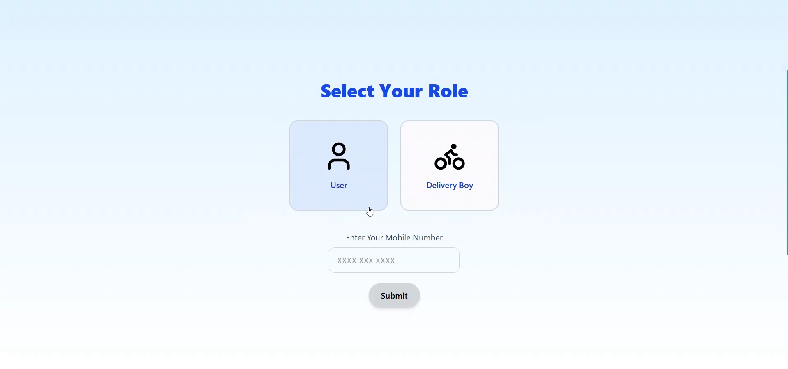 | 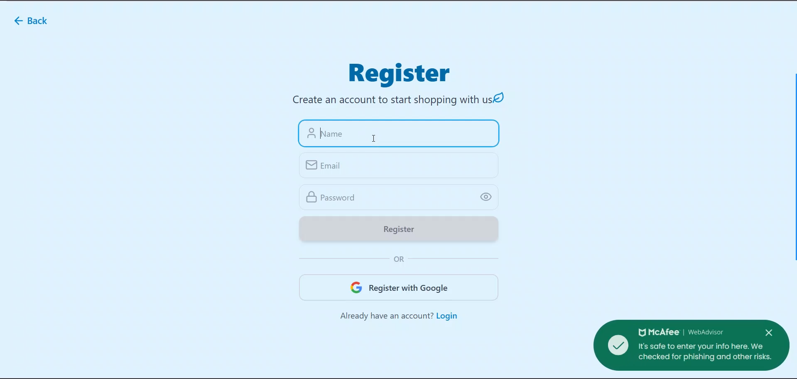 | 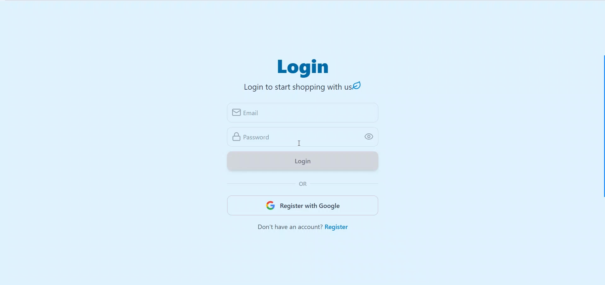 |  |

### **Customer Experience**

| Dashboard | Categories | Item View | Shopping Cart |
| :---: | :---: | :---: | :---: |
| 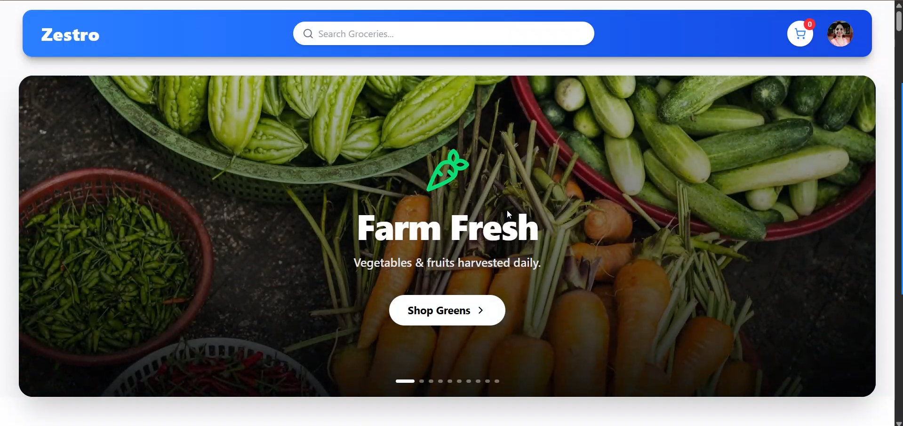 | 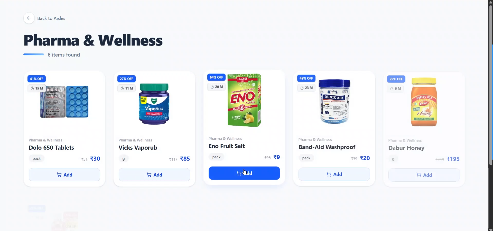 | 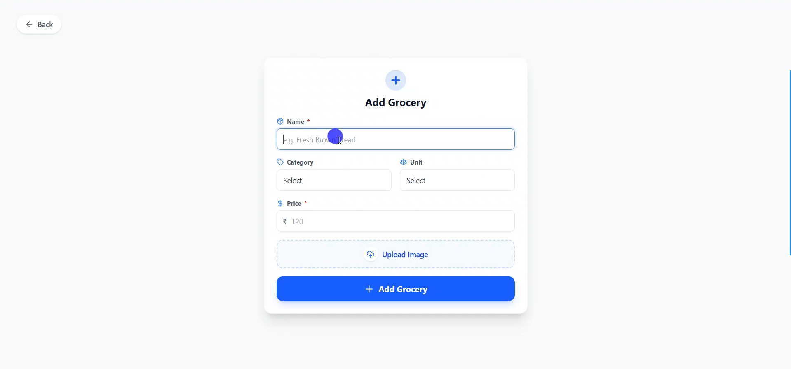 | 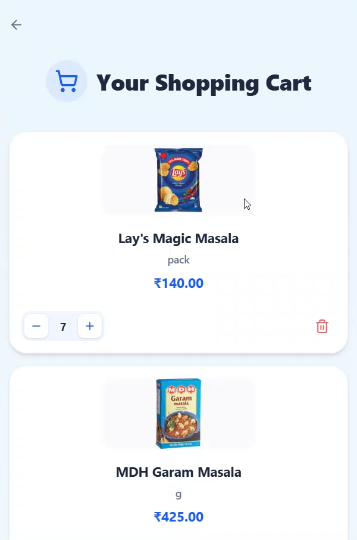 |

| Checkout | Online Payment | Order Placed | Track Order (Map) |
| :---: | :---: | :---: | :---: |
| 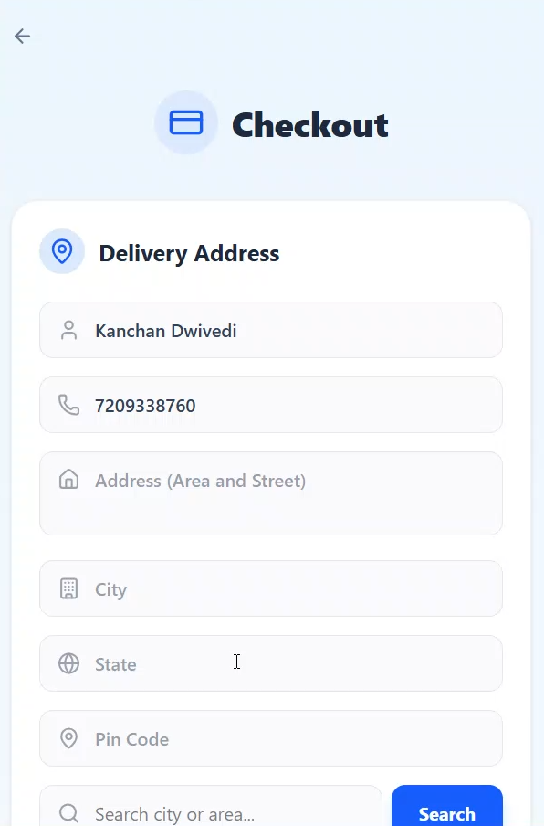 | 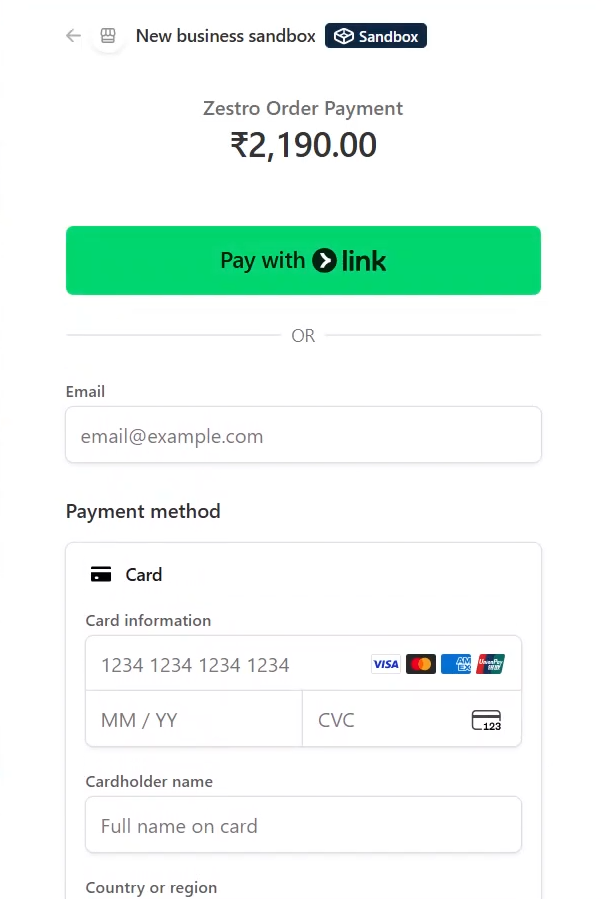 | 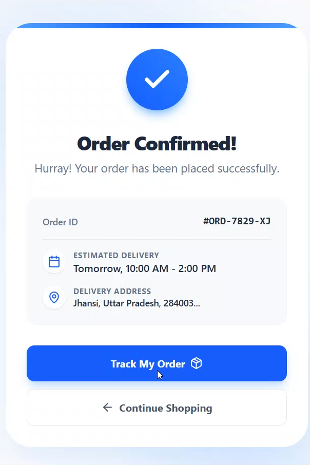 | 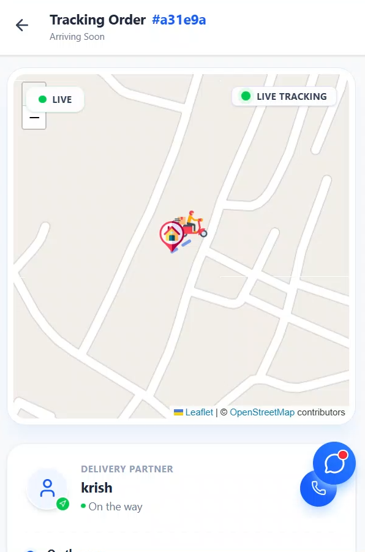 |

### **Real-time Interaction & History**

| My Orders | AI Chat (User & Driver) | Category Slider | Footer Design |
| :---: | :---: | :---: | :---: |
| 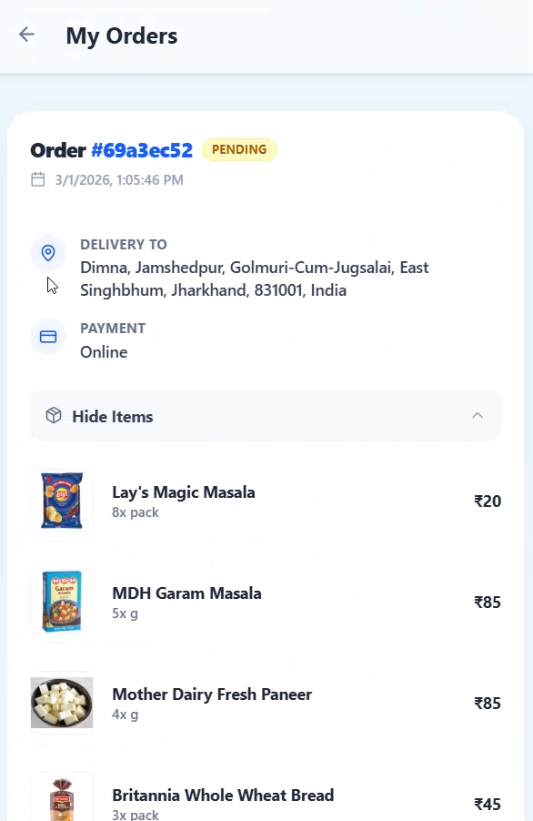 | 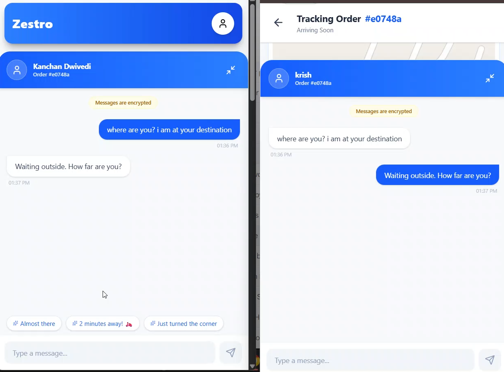 | 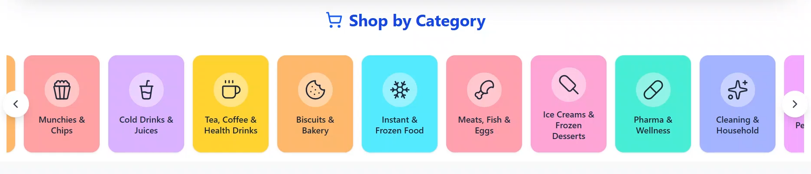 | 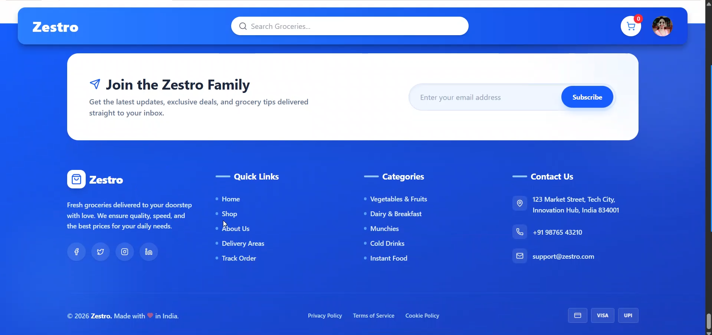 |

### **Admin & Delivery Portals**

| Admin Dashboard | Manage Groceries | Delivery Dashboard | Active Delivery |
| :---: | :---: | :---: | :---: |
|  | 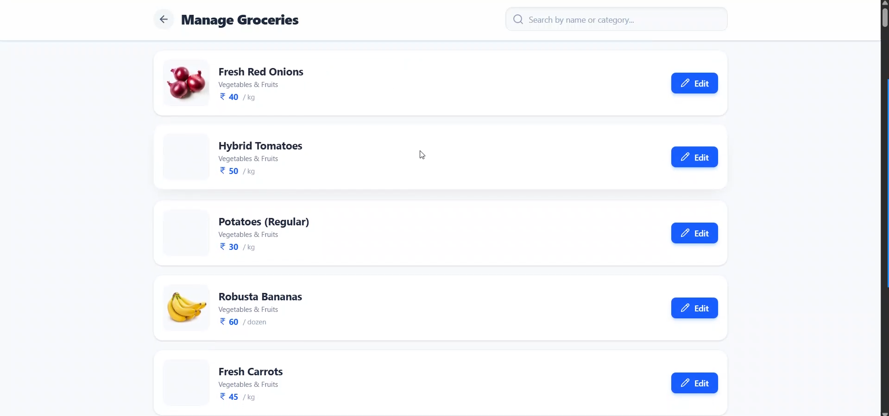 | 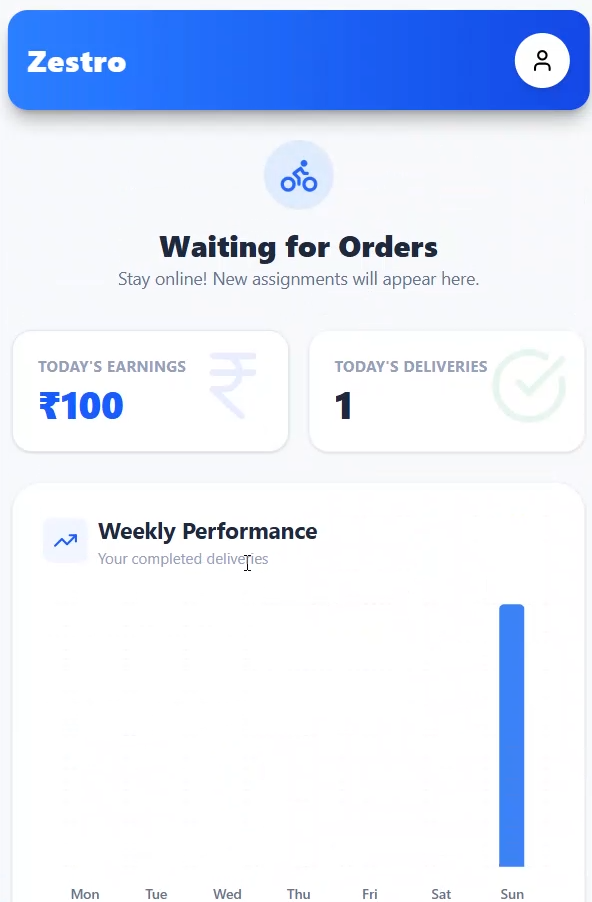 | 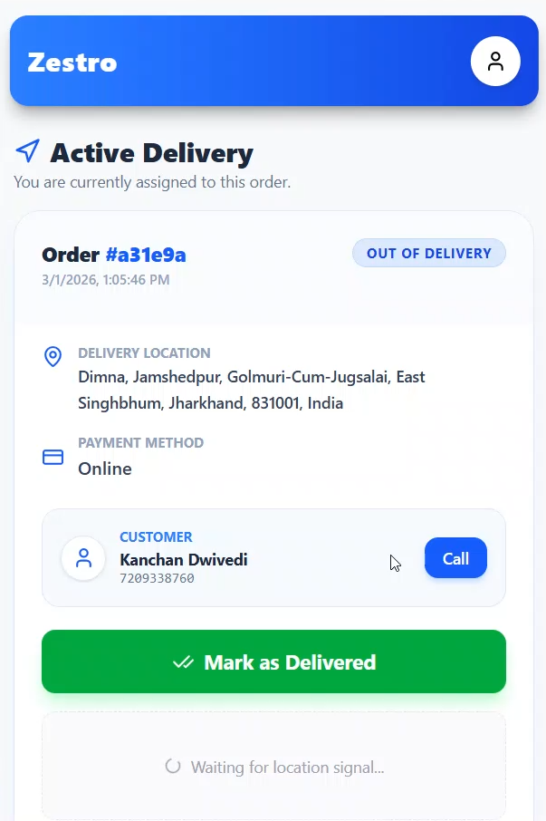 |

---

## ⚙️ Environment Variables

To run this project locally, you must set up environment variables for both the Next.js application and the Socket.io server.

> **⚠️ Security Warning:** Never commit your actual API keys to GitHub. Use `.env` files and add them to your `.gitignore`.

### 1. Client App (`my-app/.env`)

```env
# Database
MONGO_DB_URL=mongodb+srv://<USERNAME>:<PASSWORD>@cluster.mongodb.net/zestro

# Authentication (NextAuth / JWT)
AUTH_SECRET=your_generated_auth_secret
GOOGLE_CLIENT_ID=your_google_client_id
GOOGLE_CLIENT_SECRET=your_google_client_secret

# Cloudinary (Media Storage)
CLOUD_NAME=your_cloudinary_name
API_KEY=your_cloudinary_key
API_SECRET=your_cloudinary_secret

# Stripe (Payments)
STRIPE_SECRET_KEY=sk_test_your_stripe_secret
STRIPE_WEBHOOK_SECRET=whsec_your_stripe_webhook_secret

# URLs
NEXTJS_URL=http://localhost:3000
NEXT_PUBLIC_SOCKET_URL=http://localhost:5000

# Google Gemini AI (Smart Chat)
GEMINI_API_KEY=your_gemini_api_key

# Nodemailer (OTP Emails)
USER_EMAIL=your_email@gmail.com
USER_PASSWORD=your_app_specific_password
```
### 2. Socket Server (`socket-io-server/.env`)

```env
NEXTJS_URL=http://localhost:3000
PORT=5000
```

---

## 🚀 Getting Started

Follow these instructions to get the Zestro project up and running on your local machine. 

### Prerequisites

* **Node.js** (v18 or higher recommended)
* **MongoDB** (Atlas or local)
* Accounts for **Stripe**, **Cloudinary**, and **Google Cloud Console** (for Gemini & OAuth).

### Installation & Setup

1.  **Clone the Repository**
    ```bash
    git clone [https://github.com/Prajwal-dev-dsa/ZESTRO_NEXTJS.git](https://github.com/Prajwal-dev-dsa/ZESTRO_NEXTJS.git)
    cd ZESTRO_NEXTJS
    ```

2.  **Setup the Socket.io Server**
    ```bash
    cd socket-io-server
    npm install
    # Create your .env file here based on the variables above
    npm run dev
    ```
    *The socket server should now be running on port 5000.*

3.  **Setup the Next.js Application**

    Open a new terminal window/tab:
    ```bash
    cd my-app
    npm install
    # Create your .env file here based on the variables above
    npm run dev
    ```
    *The Next.js app should now be accessible at http://localhost:3000.*

---

## 🤝 Contributing

Contributions make the open-source community an amazing place to learn, inspire, and create.

1.  Fork the Project
2.  Create your Feature Branch (`git checkout -b feature/AmazingFeature`)
3.  Commit your Changes (`git commit -m 'Add some AmazingFeature'`)
4.  Push to the Branch (`git push origin feature/AmazingFeature`)
5.  Open a Pull Request

---

## 📬 Contact

**Project Link:** https://github.com/Prajwal-dev-dsa/ZESTRO_NEXTJS

**Live Application:** [Zestro on Vercel](https://zestro-zeta.vercel.app/)
